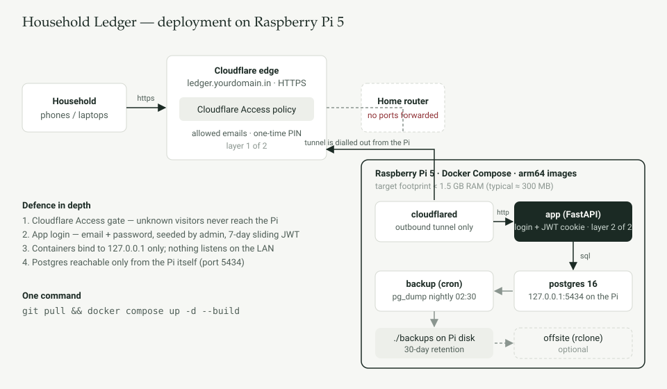

# Household Ledger

Self-hosted personal finance tracker for one household, built for a Raspberry Pi 5 running
Docker Compose behind a Cloudflare Tunnel. No public sign-up, no ports forwarded, ARM64-native
images, nightly Postgres backups, one command to deploy or update.



## What it does

| Area | Detail |
|---|---|
| Auth | Email + password, httpOnly JWT cookie, 7-day expiry, re-issued on activity. Users are added by an admin under **People**; there is no registration page. |
| Dashboard | Expense doughnut by category, income / expense / left-over figures, 12-month trend with cumulative savings, savings & investment totals. Month picker or free date range. |
| Categories | CRUD with type (expense / income), emoji icon and colour. Categories with history are archived, not deleted. |
| Payment sources | Cash, bank account, credit card, UPI, wallet — optional running balance from an opening balance. |
| Transactions | Add / edit / delete; amount, date, category, source, note, recurring flag. Filter by month, type, category, source, note text. |
| Reports | Monthly summary + category breakdown. Download as CSV or PDF. |
| Savings & investments | Holdings (equity, mutual fund, FD, PPF, other) with dated contribution entries and manually updated current value. |

Stack: FastAPI + SQLAlchemy (Python 3.12), Postgres 16, a no-build vanilla-JS front end with Chart.js,
`cloudflared`, and a tiny cron sidecar for `pg_dump`. Idle footprint on the Pi is roughly 300 MB; memory
limits in the compose file cap the whole stack well under 1.5 GB.

## Deploy on the Pi

Prerequisites: Raspberry Pi OS 64-bit (Bookworm), Docker Engine + Compose plugin, a domain on Cloudflare.

```bash
git clone https://github.com/<you>/household-ledger.git
cd household-ledger
cp .env.example .env
nano .env          # set POSTGRES_PASSWORD, JWT_SECRET, ADMIN_EMAIL, ADMIN_PASSWORD, TUNNEL_TOKEN
docker compose up -d --build
```

That's the whole deploy. Updating later is `git pull && docker compose up -d --build` (or `make update`).

Generate secrets with `openssl rand -hex 32`. Keep `POSTGRES_PASSWORD` to letters and digits — it is
embedded in a connection URL.

The first start creates the schema, the admin user from `ADMIN_EMAIL` / `ADMIN_PASSWORD`, and a set of
default categories and sources. Sign in, go to **People** and add the rest of the family.

Locally (before the tunnel is set up) the app answers on `http://127.0.0.1:8085` from the Pi itself.
Set `COOKIE_SECURE=false` temporarily if you want to test over plain HTTP from the Pi's browser.

## Cloudflare Tunnel + Access

Two independent gates sit in front of the app: Cloudflare Access at the edge, then the app's own login.

**1. Create the tunnel** — Cloudflare dashboard → Zero Trust → Networks → Tunnels → *Create a tunnel*
→ Cloudflared → name it (e.g. `pi-ledger`). Copy the token from the install command into `TUNNEL_TOKEN`
in `.env`.

**2. Route the hostname** — on the tunnel's *Public Hostname* tab add
`ledger.yourdomain.in` → service type **HTTP**, URL **`app:8000`**. (`app` is the compose service
name; the tunnel container shares its network.)

**3. Add an Access policy** — Zero Trust → Access → Applications → *Add an application* → Self-hosted.
Domain `ledger.yourdomain.in`, session duration 24h or longer. Policy: action *Allow*, include
**Emails** → list each family member's email. Identity method *One-time PIN* is enough; add Google
login if you prefer. Anyone not on the list is stopped at Cloudflare and never touches the Pi.

**4.** `docker compose up -d` — the `cloudflared` container comes up and the hostname goes live with
Cloudflare's certificate. Nothing is forwarded on the router.

**Already running cloudflared on the Pi?** Set `COMPOSE_PROFILES=` (empty) in `.env` so the tunnel
container is skipped, and add an ingress rule to your existing config:

```yaml
  - hostname: ledger.yourdomain.in
    service: http://127.0.0.1:8085
```

## Backups

The `backup` container runs `pg_dump` (custom format, compressed) every night at 02:30 into `./backups/`
on the Pi, keeps 30 days, and takes one immediately on every start. Adjust `BACKUP_CRON` and
`BACKUP_KEEP_DAYS` in `.env`.

```bash
./scripts/backup-now.sh                                   # take one now
./scripts/restore.sh backups/ledger_2026-09-15_0230.dump  # restore (stops app, replaces db, starts app)
```

**Offsite copy (optional):** install rclone on any machine, run `rclone config` to set up a remote
(Google Drive, Backblaze B2, another Pi over SFTP…), copy the resulting `rclone.conf` to
`backup/rclone/rclone.conf` on the Pi, and set `RCLONE_REMOTE=gdrive:pi-backups/ledger` in `.env`.
Each nightly dump is then also copied there.

Test a restore once. A backup you have never restored is a hope, not a backup.

## Postgres on port 5434

The database is published on the Pi at `127.0.0.1:5434` so it doesn't clash with another Postgres on
5432 and isn't visible on the LAN. To use pgAdmin / DBeaver from another machine, either SSH-tunnel
(`ssh -L 5434:127.0.0.1:5434 pi@raspberrypi`) or set `POSTGRES_BIND=0.0.0.0` in `.env`.

## Operations

```bash
make logs                                  # tail everything
docker compose ps                          # health of each container
docker stats --no-stream                   # memory per container
./scripts/add-user.sh a@b.in "Name" 'pw' --admin   # add/reset a user from the shell (lockout recovery)
```

Interactive API docs (behind login cookie) are at `/api/docs`.

## Project layout

```
docker-compose.yml     db · app · backup · cloudflared (profile "tunnel")
.env.example           every setting, commented
backend/               FastAPI app (Dockerfile, requirements.txt)
  app/main.py          startup: create schema, seed admin + defaults, serve SPA
  app/auth.py          bcrypt, JWT cookie, sliding refresh
  app/models.py        users, categories, sources, transactions, investments
  app/routers/         auth · lookups · transactions · dashboard · reports
  app/static/          index.html · app.js · styles.css · chart.umd.min.js (vendored)
backup/                cron sidecar: pg_dump + prune + optional rclone
scripts/               add-user.sh · backup-now.sh · restore.sh
docs/architecture.svg
```

## Notes and limits

- Schema is created with `create_all` on first start. Adding columns later means a manual `ALTER TABLE`
  or adding Alembic; there are no destructive migrations in this repo.
- The "recurring" flag is a label on the entry so you can spot fixed costs; it does not auto-create
  next month's entry.
- All household members see the same ledger; each entry records who added it.
- PDF export uses core PDF fonts, so the rupee sign is written as `INR` in the PDF (CSV keeps `₹`).
- Chart.js is vendored (MIT) so the page loads with no third-party requests.
