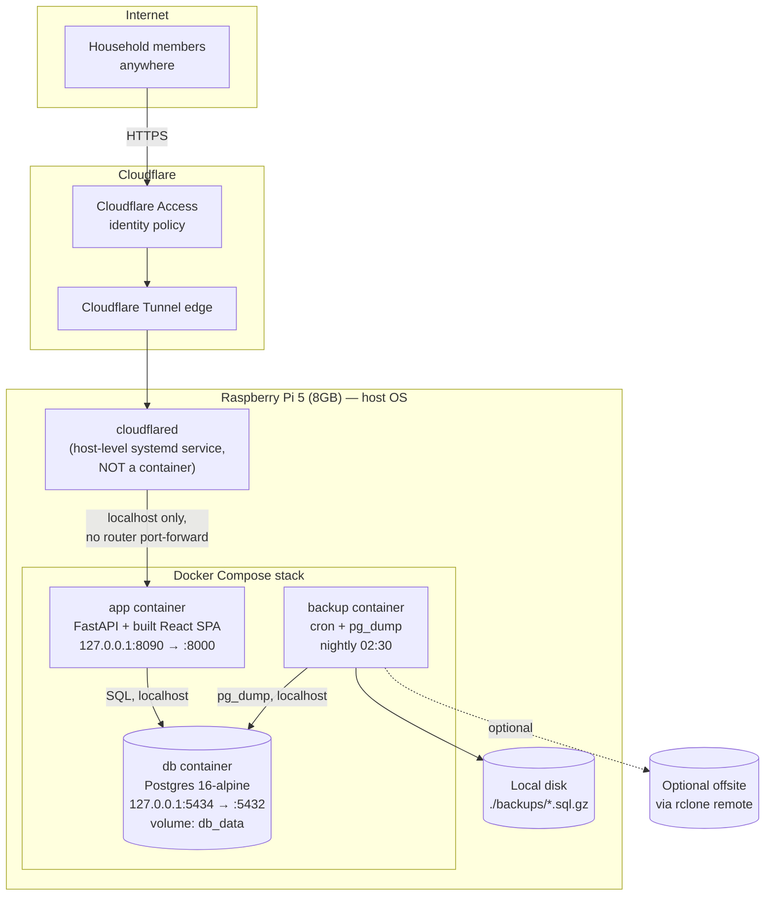

# Architecture

## Notes

- **Two layers of auth**: Cloudflare Access gates who can even reach the
  tunnel (e.g. restricted to household members' emails), and the app's
  own JWT login gates who can use it once they're through. Losing either
  layer alone doesn't expose the data.
- **No router port-forwarding, ever.** `cloudflared` runs as a host-level
  service (already running per your setup) and makes an *outbound*
  connection to Cloudflare's edge — nothing needs to be opened inbound
  on your router. It is deliberately not containerized, per your
  requirement, so it keeps working independently of `docker compose`
  restarts.
- **Only three containers**, all bound to `127.0.0.1` so nothing is
  reachable even from other devices on the LAN — only `cloudflared` (host
  process) and other host-level tools can reach them:
  - `db` — Postgres 16, ARM64-native, on host port `5434` as you specified.
  - `app` — FastAPI serves both the JSON API (`/api/*`) and the built
    React static bundle from the same container/process, so there's no
    separate nginx/frontend container to run or keep in memory.
  - `backup` — a tiny Alpine + cron sidecar that `pg_dump`s the database
    nightly, gzips it to `./backups/` on the host disk, prunes anything
    older than `BACKUP_RETENTION_DAYS`, and optionally mirrors offsite
    via `rclone` if you configure a remote.
- **Memory budget** (soft `deploy.resources.limits`, not hard cgroup
  caps unless you run Swarm): db 400M, app 500M, backup 100M ≈ 1GB
  ceiling, comfortably under the 1.5GB target with headroom for the
  other services already on the Pi.
